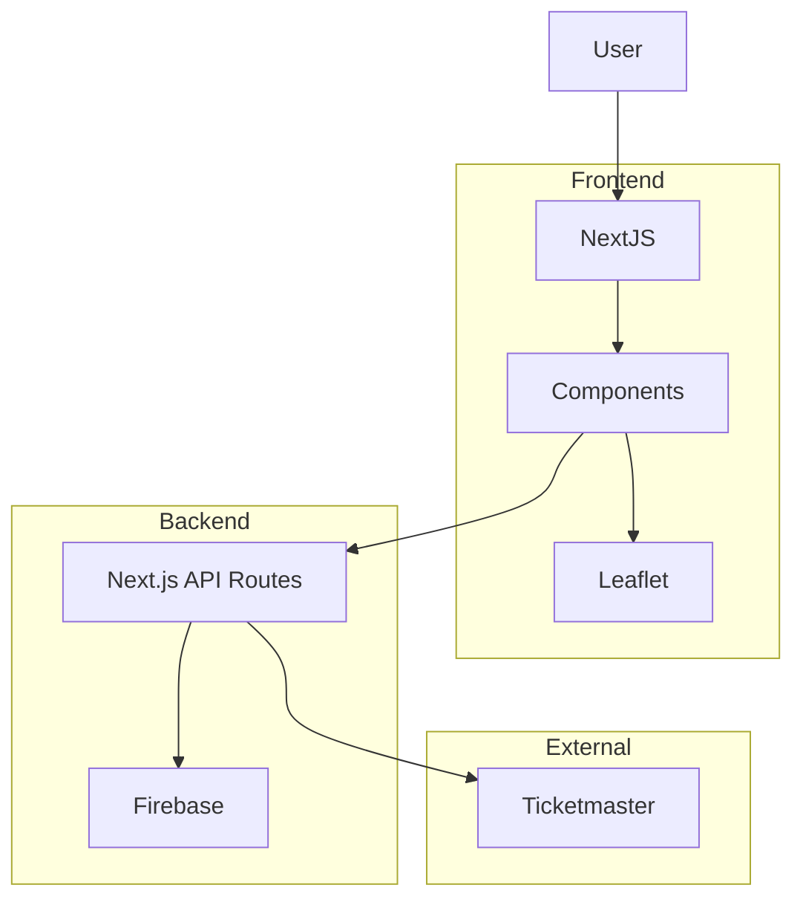
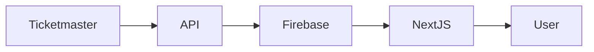

# Eventania

<p align="center">
  <h1 align="center">Eventania</h1>

  <p align="center">
    A modern event discovery platform powered by the Ticketmaster Discovery API.
  </p>

  <p align="center">
    Built with <strong>Next.js 15</strong>, <strong>React 19</strong>, <strong>Firebase</strong>, <strong>Leaflet</strong>, and <strong>TypeScript</strong>.
  </p>
</p>

---

# Overview

Eventania is a modern event discovery platform that enables users to browse upcoming events, explore detailed event information, locate venues on interactive maps, and stay informed about concerts, festivals, sports, theatre, and entertainment events.

The application integrates the Ticketmaster Discovery API with Firebase to provide a responsive, data-driven experience while demonstrating modern full-stack web development using the Next.js App Router.

The project showcases server-side rendering, API integration, reusable component architecture, interactive mapping, cloud database integration, and responsive UI development.

---

# Features

## Event Discovery

- Browse upcoming events
- Search available events
- View detailed event information
- Explore multiple event categories
- Responsive event listing

---

## Event Details

- Event description
- Venue information
- Event images
- Dates and schedules
- Ticket information (when available)

---

## Interactive Maps

- Venue location
- Interactive Leaflet maps
- Geographic event visualization

---

## Event Management

- Firebase integration
- Event synchronization
- API-backed event data
- Dynamic routing

---

## User Experience

- Responsive design
- Smooth page transitions
- Modern animations
- Mobile-friendly interface
- Fast navigation

---

# Technical Highlights

- Next.js 15 App Router
- React 19
- TypeScript
- Ticketmaster Discovery API integration
- Firebase integration
- Interactive maps with Leaflet
- Dynamic routing
- Server-side API routes
- Component-driven architecture
- Framer Motion animations

---

# System Architecture



---

# Event Data Flow



---

# Technology Stack

## Frontend

- Next.js 15
- React 19
- TypeScript
- DaisyUI
- Framer Motion
- Leaflet
- React Leaflet

## Backend

- Next.js Route Handlers

## Database

- Firebase

## External APIs

- Ticketmaster Discovery API

---

# Project Structure

```
src/

├── app/
│   ├── api/
│   ├── events/
│   ├── event-form/
│   └── layout.tsx
│
├── components/
│   ├── event-card.tsx
│   ├── event-detail-slider.tsx
│   └── event-map.tsx
│
├── lib/
│   ├── firebase/
│   └── ticket-master/
```

### Directory Overview

| Directory | Purpose |
|------------|----------|
| `app` | Application routing and pages |
| `app/api` | Server-side API routes |
| `components` | Reusable UI components |
| `lib/firebase` | Firebase configuration and utilities |
| `lib/ticket-master` | Ticketmaster API integration |

---

# API Overview

The application integrates with the Ticketmaster Discovery API to retrieve event information.

Server-side route handlers are responsible for:

- Fetching events
- Synchronizing event data
- Reducing client-side API exposure

---

# Interactive Maps

Venue locations are rendered using Leaflet, allowing users to visualize event locations through an interactive map interface.

---

# Installation

Clone the repository.

```bash
git clone https://github.com/kishky101/Eventania.git
```

Navigate into the project.

```bash
cd Eventania
```

Install dependencies.

```bash
npm install
```

Run the development server.

```bash
npm run dev
```

---

# Environment Variables

Create a `.env.local` file.

```env
TICKETMASTER_API_KEY=

NEXT_PUBLIC_FIREBASE_API_KEY=

NEXT_PUBLIC_FIREBASE_AUTH_DOMAIN=

NEXT_PUBLIC_FIREBASE_PROJECT_ID=

NEXT_PUBLIC_FIREBASE_STORAGE_BUCKET=

NEXT_PUBLIC_FIREBASE_MESSAGING_SENDER_ID=

NEXT_PUBLIC_FIREBASE_APP_ID=
```

---

# Available Scripts

```bash
npm run dev
```

Starts the development server.

```bash
npm run build
```

Creates a production build.

```bash
npm run start
```

Starts the production server.

```bash
npm run lint
```

Runs ESLint.

---

# Engineering Decisions

### Next.js App Router

The application uses the App Router to organize event discovery, event detail pages, API routes, and event management into a scalable routing structure.

### Ticketmaster API

Event information is retrieved through the Ticketmaster Discovery API, providing reliable access to live event data while keeping the application lightweight.

### Firebase

Firebase is used as the application's cloud backend for storing and synchronizing event-related data.

### Leaflet

Interactive venue maps enhance the user experience by visualizing event locations rather than relying solely on textual addresses.

### Component-Based Design

The UI is divided into reusable components, including event cards, image sliders, and map components, promoting maintainability and reusability.

---

# Performance Considerations

- Server-side API routes
- Optimized image loading
- Dynamic routing
- Component reuse
- Responsive layouts
- Reduced client-side API exposure

---

# Security Considerations

- API keys managed through environment variables
- Server-side communication with external APIs
- Firebase configuration isolated from UI components

---

# Testing

Automated testing has not yet been implemented.

Recommended additions:

- Jest
- React Testing Library
- Playwright
- GitHub Actions

---

# Deployment

The application is designed for deployment on Vercel.

Deployment requires:

- Firebase project
- Ticketmaster API credentials

---

# Future Improvements

- User authentication
- Personalized event recommendations
- Favorites and saved events
- Event filtering by location and category
- Calendar integration
- Ticket purchase tracking
- Notifications for upcoming events
- Offline caching
- Docker support
- CI/CD pipeline
- End-to-end testing

---

# Contributing

Contributions are welcome.

If you'd like to improve the project, fork the repository, create a feature branch, and submit a pull request.

---

# License

This project is licensed under the MIT License.

---

# Acknowledgements

Built using several outstanding technologies and services:

- Next.js
- React
- Firebase
- Ticketmaster Discovery API
- Leaflet
- React Leaflet
- DaisyUI
- Framer Motion
